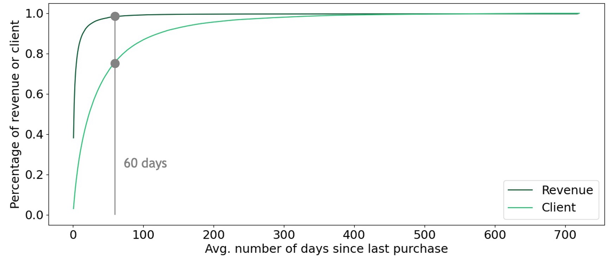
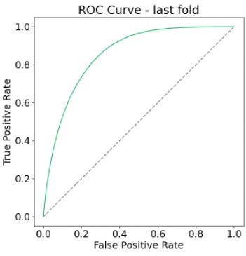

# Reshaping Business with AI
[]()
[](https://github.com/psf/black)
[](https://pycqa.github.io/isort/)
[](https://github.com/astral-sh/ruff)
[](https://github.com/stlbnmaria/reshaping-business-with-ai/blob/main/.pre-commit-config.yaml)

Authors: Adib Alhachem, Zineb Cherif Belkhayat, Lohouess Kokora, Madhura Nirale, Jonas Reineke & Maria Susanne Stoelben

## Description
This is an MVP for churn prediction of a global construction and renovation products distributor. The provided data consists of the last 2 years of transaction data incl. 171k clients, 607k products and 582 branches. This data was merely a representative subset of the business activities.

First, churn was defined as a inactivity of a client over the last 60 days (see graph below). By this, 24% of the clients and 1.6% of the revenue over the last 2 years is addressed. Multiple thresholds were tested for the modeling and it seems quite robust, thus the threshold follows business decisions.



Second, data and feature engineering was performed to maximise the information containing possible patterns of clients. Created columns include sales, quantity, nr. orders per channel, share of nr. orders, sales & quantity to last 2 years, nr. returns, and share of returns for the last 60 days and avg. time since the last purchase, nr. returns, and share of returns for the last 2 years.

## Setup
```bash
python3 -m venv .venv
source .venv/bin/activate
python -m pip install --upgrade pip
pip install -r requirements.txt
pip install -e .
```

```bash
pip install -r requirements-dev.txt
pre-commit install
```

## Run Modeling Pipeline
```bash
python src/modeling.py
```

## Results
<div>

The modeling strategy was to use classical ML algorithms such as Random Forest or XGBoost, which show superior performance according to recent papers in such a context. The final model is a XGBoost that based on the last 60 days of transactions (and add. long term historical information) predicts the likelihood of a client to churn in the next 60 days.<br><br>
Results in the table are shown in descending order by fold, meaning that the the most recent test data is fold 0. On the left, the ROC curve for the last fold is shown (by the aforementioned logic, this is fold 0). It shows that the model delivers promising results for a prototype to predict the likelihood of churn of a customer in the next 60 days. Additionally, the model shows outstanding robustness over time with less than 1% standard deviation for BACC & AUROC.
</div>

<br>

| Fold | Train Nr. Clients | Train Churn Rate | Test Nr. Clients | Test Churn Rate | Balanced Accuracy | AUROC |
| --- | --- | --- | --- | --- | --- | --- |
| 0 | 82753 | 0.18 | 91382 | 0.20 | 0.78 | 0.86 |
| 1 | 87676 | 0.24 | 83054 | 0.18 | 0.77 | 0.86 |
| 2 | 88126 | 0.21 | 88338 | 0.24 | 0.78 | 0.85 |
| 3 | 91774 | 0.23 | 87990 | 0.21 | 0.78 | 0.86 |
| 4 | 91840 | 0.22 | 91167 | 0.22 | 0.77 | 0.85 |
| Avg. | - | - | - | - | 0.78 | 0.85 |


## Next Steps
To go further, it would be useful to include all transaction data and build a database with client as well as product information to be able to cluster global patterns for churn.
